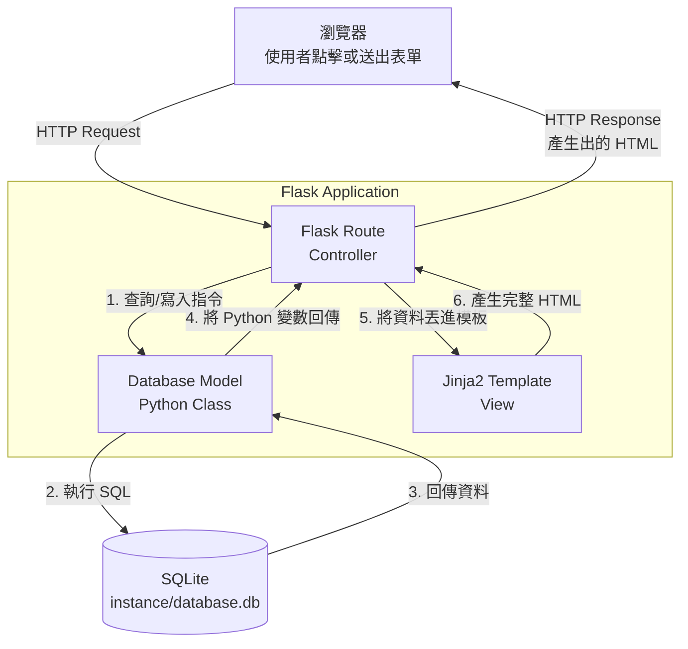

# 系統架構設計 (競技遊戲對戰紀錄系統)

## 1. 技術架構說明

本專案將採用輕量、成熟且易於開發的技術堆疊，並落實傳統的 MVC 架構概念。

**選用技術與原因：**
- **後端框架：Python + Flask**
  - **原因**：Flask 是輕量化框架，能讓我們用最少的時間搭建出具備完整路由與請求處理的後端，非常適合 MVP 階段的小型規模。
- **模板引擎：Jinja2**
  - **原因**：與 Flask 原生高度整合，能讓伺服器端直接負責產生含有資料的 HTML 頁面，不需額外學習複雜的前端框架即可做到視圖渲染。
- **資料庫：SQLite (建議搭配 SQLAlchemy)**
  - **原因**：完全無須額外設定資料庫伺服器，資料儲存在單一檔案中，適合此種以快速開發或個人紀錄為主的小型專案。
- **架構模式：不採用前後端分離**
  - **原因**：頁面多為表單輸入或資料列表，並無大量非同步更新的需求，以 Flask + Jinja2 一併完成可大幅降低開發複雜度與時程。

**Flask MVC 模式說明：**
- **Model (模型)**：負責與 SQLite 互動的資料存取層。例如定義「牌組 (Deck)」和「對戰紀錄 (Match)」等資料表，以及將資料存入/讀取的相關邏輯。
- **View (視圖)**：負責最終呈現給使用者的網頁畫面。在本專案由 Jinja2 提供 HTML 版面，結合 static 中的 CSS 提供樣式。
- **Controller (控制器)**：由 Flask 的 `app.route()` 擔當。接收瀏覽器傳來的 HTTP 要求（例如提交表單、請求列表），驗證資料並指揮 Model 處理，最後把資料塞進 View 裡回傳。

---

## 2. 專案資料夾結構

整個專案的所有程式碼會依據 MVC 架構分門別類，這有助於未來增刪功能或除錯。

```text
(專案根目錄)/
│
├── app/                        # 應用程式主目錄
│   ├── __init__.py             # 初始化 Flask app 實例與資料庫套件
│   ├── routes/                 # Flask 路由 (Controller)，接收請求。
│   │   ├── __init__.py
│   │   ├── deck_routes.py      # 主戰牌組相關路由 (新增、列表、刪除)
│   │   └── match_routes.py     # 對戰紀錄相關路由 (新增、分析統計)
│   ├── models/                 # 資料庫模型 (Model)
│   │   ├── __init__.py
│   │   ├── deck.py             # Deck 資料表定義
│   │   └── match.py            # Match 資料表定義
│   ├── templates/              # HTML 介面檔案 (View)
│   │   ├── base.html           # 全域共用版型 (導覽列與共同 CSS)
│   │   ├── decks/              # 主戰牌組的相關頁面
│   │   │   └── list.html
│   │   └── matches/            # 對戰紀錄的相關頁面
│   │       ├── form.html       # 填寫對戰表單
│   │       ├── list.html       # 歷史清單
│   │       └── stats.html      # 勝率分析頁面
│   └── static/                 # 靜態資源檔案
│       ├── css/
│       │   └── style.css       # 專案自訂的外觀樣式
│       └── js/                 # 若有需要微量的前端互動腳本
│
├── instance/                   # 存放本機產生、不建議放入版控的資料
│   └── database.db             # 系統使用的 SQLite 資料庫檔案
│
├── docs/                       # 專案說明文件
│   ├── PRD.md                  # 產品需求文件
│   └── ARCHITECTURE.md         # 系統架構文件 (本文件)
│
├── requirements.txt            # Python 第三方套件依賴清單
└── app.py                      # 系統啟動入口 (執行 python app.py)
```

---

## 3. 元件關係圖

以下使用 Mermaid 語法呈現系統資料與請求流向圖，展示瀏覽器與 Flask 內部運作元件的關聯。



---

## 4. 關鍵設計決策

1. **統一路由入口與拆分 (Blueprints 取代單一檔案)**
   - **決策與原因**：即便現在系統尚算單純，但將路由分拆為 `deck_routes.py` 和 `match_routes.py`（此可搭配 Flask Blueprints 功能實作）能避免過於臃腫的 `app.py`，保持 Controller 各司其職，後續好維護。
   
2. **採用 SQLAlchemy 等 ORM (物件關聯對映)**
   - **決策與原因**：直接使用 SQL 語句在 Controller 中撰寫容易產生 SQL Injection 漏洞且難以除錯。透過 ORM 定義 Python Class (Model) 對應資料表，能以純 Python 語法如 `Deck.query.all()` 來操作資料，乾淨且安全。

3. **基礎模板繼承 (Jinja2 Template Inheritance)**
   - **決策與原因**：使用 `base.html` 包含共同的標頭( `<head>`)、導覽列(Navbar)等框架，其餘頁面如 `matches/list.html` 透過 `` 繼承。這樣修改選單時只要更動一處，能確保外觀設計統一。

4. **靜態資源與前端邏輯最小化**
   - **決策與原因**：由於需求重點在於表單紀錄與數據分析，所有的運算將留在後端 (Flask) 完成，只把計算完畢的數字或字串送入模板呈現，降低對前端 JavaScript 的依賴並減少瀏覽器的運算。
