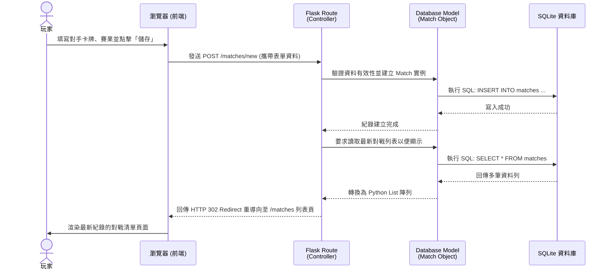

# 系統流程圖 (競技遊戲對戰紀錄系統)

## 1. 使用者流程圖（User Flow）

此流程圖展示玩家進入系統後，如何新增和管理牌組、紀錄對戰，以及查看勝率數據的整體操作路徑。

```mermaid
flowchart LR
    A([玩家進入系統]) --> B[首頁 / 儀表板]
    
    B --> C{選擇功能模組}
    
    %% 主戰牌組管理
    C -->|管理牌組| D[主戰牌組列表]
    D --> E{執行操作}
    E -->|新增| F[填寫牌組名稱/配置] --> D
    E -->|刪除| G[確認刪除牌組] --> D
    
    %% 對戰紀錄
    C -->|新增對戰| H[填寫對戰表單]
    H --> I[1. 選擇我方牌組]
    I --> J[2. 輸入對手關鍵單卡(如火箭)]
    J --> K[3. 填寫勝負與備註]
    K --> L[送出儲存]
    L --> M[歷史對戰清單]
    
    C -->|查看紀錄| M
    M --> M2{編輯紀錄?}
    M2 -->|刪除| Q[刪除該筆對局] --> M
    
    %% 數據分析
    C -->|查看分析| N[勝率統計頁面]
    N --> O[選擇特定的己方牌組]
    O --> P[顯示對抗各敵方針對卡的勝率統計表]
```

## 2. 系統序列圖（Sequence Diagram）

這裡以核心功能「玩家新增一筆對戰紀錄」為例，展示資訊在系統內部是如何流動並存入資料庫的。



## 3. 功能清單對照表

本表列出每個使用者功能在 Flask 系統內對應的網址路徑（URL）及 HTTP 請求方法，以此作為後續開發介面（API / Route）的基礎。

| 功能模組 | 功能描述 | HTTP 方法 | URL 路徑 (暫定規劃) |
| :--- | :--- | :--- | :--- |
| **首頁** | 進入網站首頁 (儀表板導覽) | GET | `/` |
| **牌組管理** | 列出所有主戰牌組 | GET | `/decks` |
| **牌組管理** | 提交新增牌組資料 | POST | `/decks` |
| **牌組管理** | 刪除單一主戰牌組 | POST | `/decks/<id>/delete` |
| **對戰紀錄** | 列出所有歷史對戰紀錄 | GET | `/matches` |
| **對戰紀錄** | 顯示新增紀錄表單 (讓使用者選牌組) | GET | `/matches/new` |
| **對戰紀錄** | 提交對戰紀錄資料並儲存 | POST | `/matches/new` |
| **對戰紀錄** | 刪除單筆紀錄 | POST | `/matches/<id>/delete` |
| **勝率分析** | 查看指定牌組的勝率報表 | GET | `/stats` |
